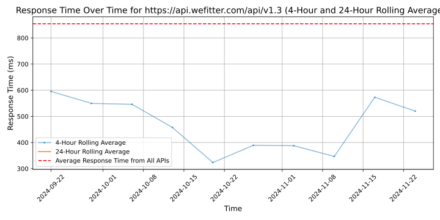

# [WeFitter](https://wefitter.com)

WeFitter helps digital health platforms improve business performance, engagement and data insights introducing an aggregator API that provides connections with todays most used fitness app's, wearables & gamification elements.

WeFitter's easy to integrate API will boost up user engagement and gives insight in users health profiles in order to personalize content, offerings and health advise. 

WeFitter is build by Thunderbyte.AI, a Dutch Al/ ML organisation with over 12 years of experience in building digital health products.  

Ask for a demo > business@wefitter.com

## Response Times

#### [api.wefitter.com/api/v1.3](https://api.wefitter.com/api/v1.3)

