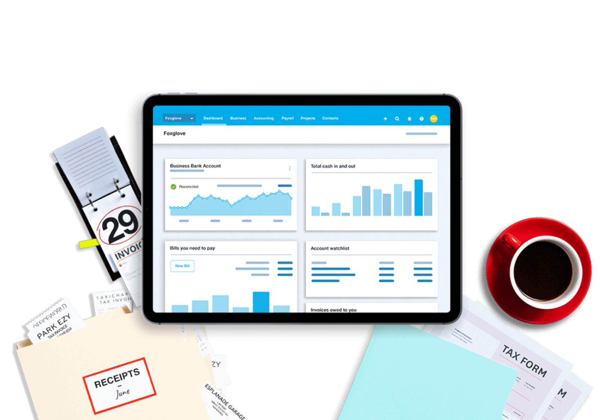
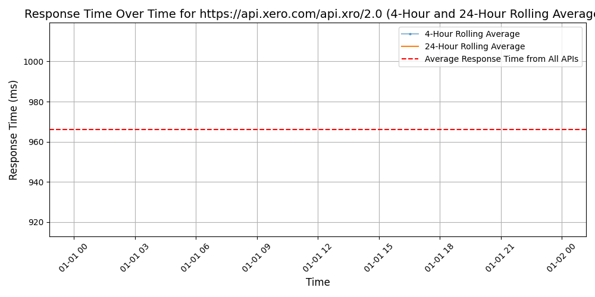

# [Xero](https://xero.com)

Xero is a global small business platform with 3.5 million subscribers which includes a core accounting solution, payroll, workforce management, expenses and projects. Xero also has an extensive ecosystem of connected apps and connections to banks and other financial institutions helping small businesses access a range of solutions from within Xero's open platform to help them run their business and manage their finances. For four consecutive years (2020-2023) Xero was included in the Bloomberg Gender-Equality Index. In 2021 and 2022, Xero was included in the Dow Jones Sustainability Index (DJSI), powered by the S&P Global Corporate Sustainability Assessment. Xero is a FIFA Women's Football partner.

Get support http://central.xero.com

## Response Times

#### [api.xero.com/api.xro/2.0](https://api.xero.com/api.xro/2.0)

