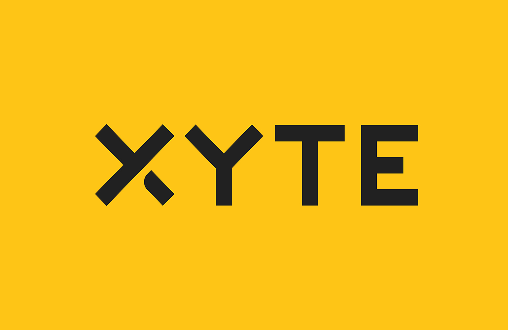

# [Xyte](https://xyte.io)

Xyte's Device Cloud is the first all-in-one servitization platform designed for device and hardware manufacturers to cloudify, operate, support, and commercialize their connected devices in a unified platform. 

We enable OEMs across different industries to navigate their digital journey, transforming their devices into integrated business solutions that combine hardware, software and services. The only business and commerce platform designed specifically for IoT device manufacturers, our fully-federated Device Cloud empowers OEMs to manage the complete lifecycle of their devices, from the minute they leave the warehouse through aftermarket sales to end customers.

Our out-of-the-box applications for asset management, remote support, ecommerce and subscription management, financing, and a powerful and secure back office suite help OEMs boost revenue and market growth, optimize operational efficiencies, gain instant insights into equipment and device performance, and develop sustainable customer relationships.

