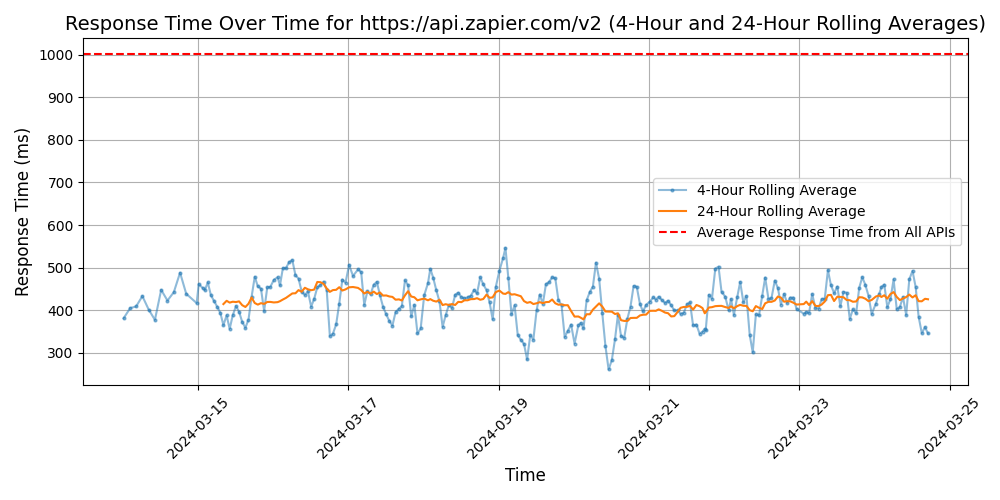

# [Zapier](https://zapier.com)

Zapier is a tool that allows users to connect and automate workflows between different apps and services. With Zapier, users can create "Zaps" that integrate various applications to streamline tasks and improve efficiency. It offers a wide range of integrations, making it easy for users to set up automated actions without the need for coding skills.

## Response Times

#### [api.zapier.com/v2](https://api.zapier.com/v2)

