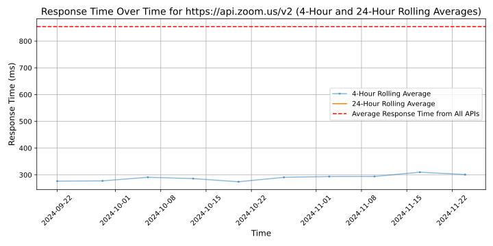

# [Zoom](https://zoom.us)

Zoom is a video conferencing platform that allows users to connect remotely for virtual meetings, webinars, online events, and collaborative work sessions. With features like screen sharing, virtual backgrounds, and chat functionality, Zoom is a popular tool for individuals and businesses to communicate and collaborate in real-time.

## Response Times

#### [api.zoom.us/v2](https://api.zoom.us/v2)

