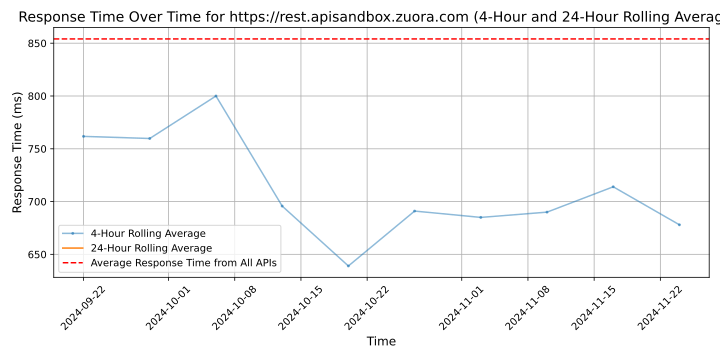
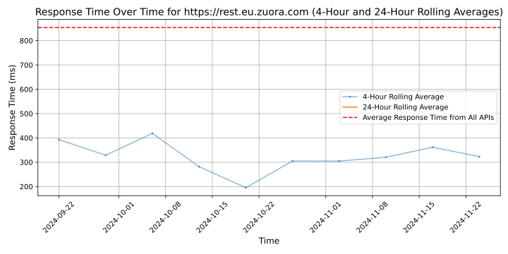
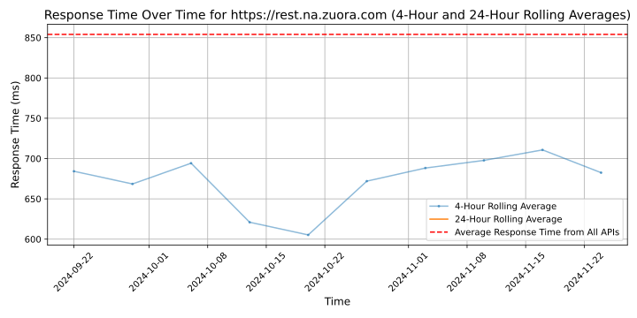
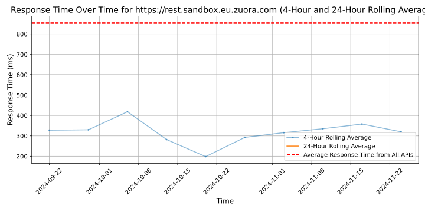
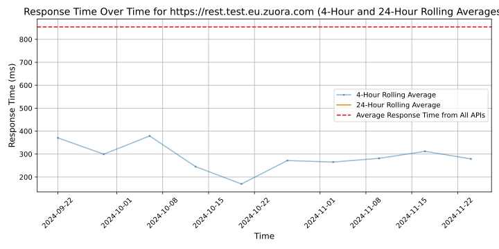
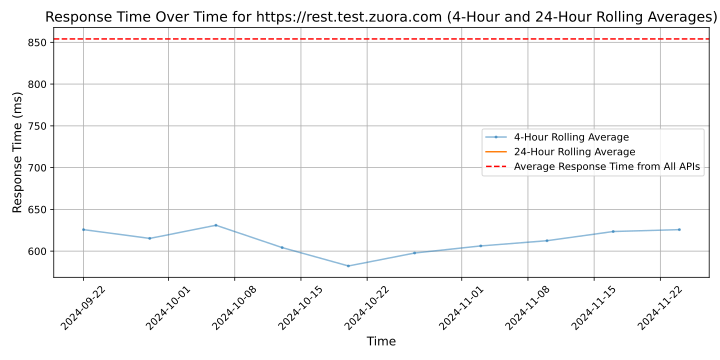

# [Zuora](https://zuora.com)

Zuora is a subscription management platform that helps businesses manage their subscription-based services efficiently. It provides tools for billing, revenue recognition, subscription analytics, and more. Zuora empowers companies to launch and scale subscription models, optimize pricing strategies, and enhance customer relationships.

## Response Times

#### [rest.apisandbox.zuora.com](https://rest.apisandbox.zuora.com)

#### [rest.eu.zuora.com](https://rest.eu.zuora.com)

#### [rest.na.zuora.com](https://rest.na.zuora.com)

#### [rest.sandbox.eu.zuora.com](https://rest.sandbox.eu.zuora.com)

#### [rest.sandbox.na.zuora.com](https://rest.sandbox.na.zuora.com)

#### [rest.test.eu.zuora.com](https://rest.test.eu.zuora.com)

#### [rest.test.zuora.com](https://rest.test.zuora.com)

#### [rest.zuora.com](https://rest.zuora.com)

